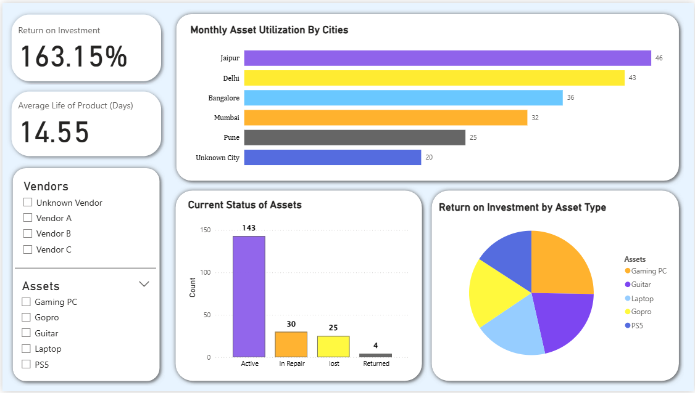

# Rental Assets Data Analysis Project

This project focuses on analyzing rental asset data to uncover trends in usage, vendor performance, and financial outcomes. It follows a two-stage pipeline:

1. **Data Cleaning & Preprocessing** (Python)  
2. **Interactive Dashboard** (Power BI)

---

## 1. Data Cleaning & Preprocessing (Python)

Data preparation was done using Python to clean and structure raw inputs into an analysis-ready format.

### File
- `Rental_Assets_Data_cleaning_and_preprocessing.ipynb`

### Key Steps

- **Read & Inspect**: Loaded `Rental_Asset_Dataset.csv`
- **Column Cleaning**: Standardized column names to `snake_case`
- **Duplicate Removal**: Removed all duplicate records
- **Null Handling**:
  - Filled missing `vendor_name` with `"Unknown Vendor"`
  - Imputed missing `monthly_rent` using the **median**
  - Cleaned malformed `city` entries and filled with `"Unknown City"`
- **Type Conversion**: Converted acquisition dates to `datetime`
- **Standardization**: Harmonized inconsistent entries in key columns

✅ Final cleaned dataset was used for Power BI reporting.

---

## 📊 2. Power BI Dashboard

An interactive dashboard was created in Power BI to visualize and explore the asset data from multiple dimensions.

### 📁 File
- `Rental Assets Data Analysis Dashboard.pbix`

### ⚙️ Key Features

- **Data Model**
  - Custom measures and calculated columns were created (e.g., ROI, asset age)

- **Visualizations**
  - City-wise asset distribution and performance
  - Time-based asset acquisition and usage patterns
  - Vendor-level comparisons of rent, usage, and total value
  - KPIs: Return on Investment, Lifecycle Duration, Utilization

- **Design**
  - Interactive filters and slicers for drill-down analysis
  - Clean, sectioned visuals with a focus on usability

---

### Dashboard Preview

## Case Study

A brief case study was also conducted based on the business insights derived from the dashboard, helping simulate a real-world analytics scenario.

---

## Conclusion

This project showcases a full analytics workflow — from raw data to actionable insights. By combining Python for preprocessing with Power BI for visualization, it delivers a complete solution to analyze asset rental performance across cities, vendors, and time.

